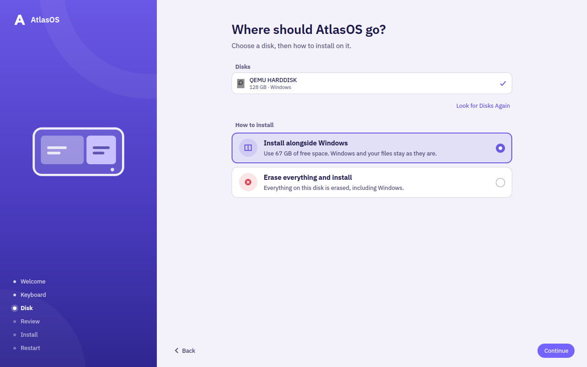
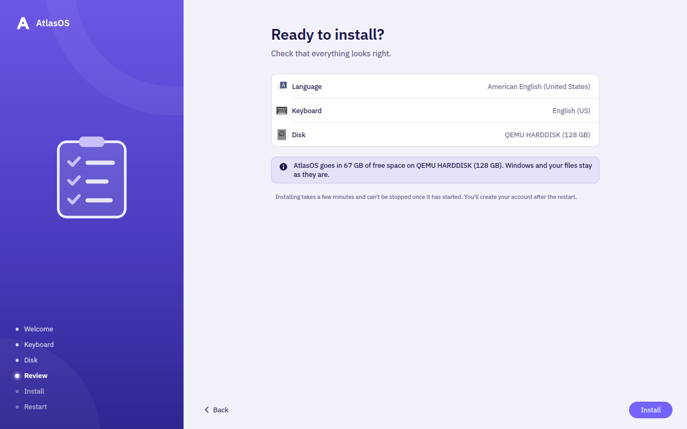
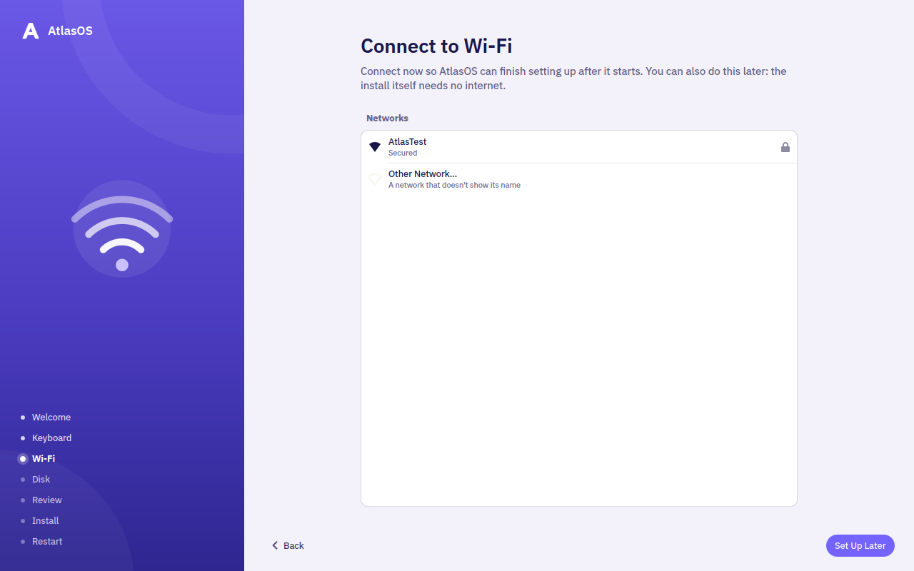
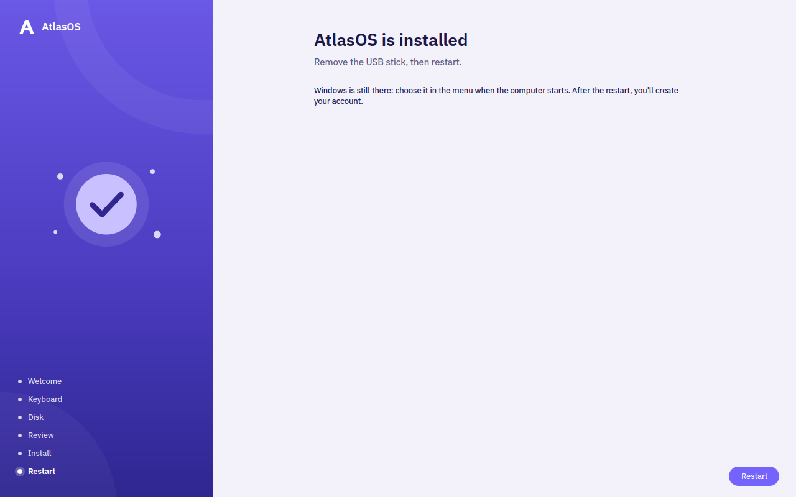

# Atlas Installer

The installer for [AtlasOS](https://github.com/EternalCoder454/AtlasOS), a
bootc system based on Fedora 44 with KDE Plasma. It replaces the Anaconda ISO.

The ISO is a live session of AtlasOS itself, built from the published image.
It boots straight into the installer, which copies the image that is on the
ISO to the disk with `bootc install`. No internet connection is needed. The
installed system tracks `ghcr.io/eternalcoder454/atlasos:stable`, and its
first update downloads only the layers that changed since the ISO was built.


## What it does

- **Language and keyboard.** The keyboard layout switches at once, so you can
  try it. The installer itself is in English.
- **Wi-Fi** (when there's no cable). The connection is carried over to the
  installed system.
- **Disk.** Erase a disk, or install alongside Windows in its free space.
  Windows, its partitions and its boot loader are left exactly as they were,
  and Windows gets an entry in the boot menu.
- **Progress, then restart.** You create your account after the restart,
  in AtlasOS's own first-boot setup.

The installer never lists the USB stick or CD it was started from, and greys
out disks smaller than 40 GB.

| Disk | Review |
|---|---|
|  |  |
| **Wi-Fi** | **Finished** |
|  |  |

## Requirements

- A UEFI PC (no legacy BIOS). Secure Boot can be on or off.
- A disk of at least 40 GB, or at least 40 GB of free space beside Windows (a
  little more if Windows' EFI partition is too small to share).

Not in version 1: disk encryption, custom partitioning, and installer
translations.

## Building the ISO

You need Podman. No root is needed.

```sh
iso/make-iso.sh                  # from the published :stable, to build/atlasos.iso
iso/make-iso.sh --local          # from this machine's localhost/atlasos:latest
```

From the AtlasOS repository, `just iso` and `just iso-local` run the same
script.

Write the ISO to a USB stick with Fedora Media Writer or `dd`, or boot it in a
VM.

## Development

See [DEV.md](DEV.md).

## License

MIT. See [LICENSE](LICENSE).
