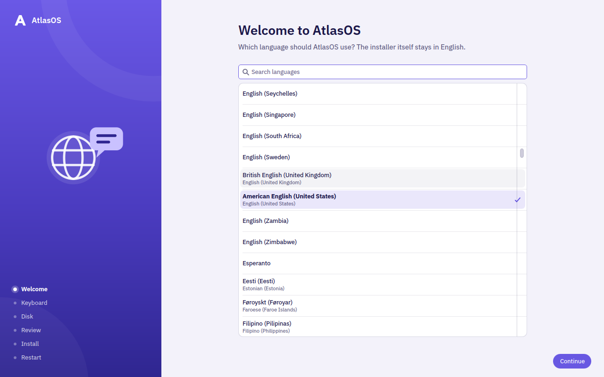

# Atlas Installer

The installer for [AtlasOS](https://github.com/EternalCoder454/AtlasOS), a
bootc system based on Fedora 44 with KDE Plasma. It replaces the Anaconda ISO.

The ISO is a live session of AtlasOS itself, built from the published image.
It boots straight into the installer, which copies the image that is on the
ISO to the disk with `bootc install`. No internet connection is needed. The
installed system tracks `ghcr.io/eternalcoder454/atlasos:stable`, and its
first update downloads only the layers that changed since the ISO was built.



## What it does

- **Language and keyboard.** The keyboard layout switches at once, so you can
  try it. The installer itself is in English.
- **Wi-Fi** (when there's no cable). The connection is carried over to the
  installed system.
- **Disk.** Erase a disk, or install alongside Windows in its free space.
  Windows, its partitions and its boot loader are left exactly as they were,
  and Windows gets an entry in the boot menu.
- **Progress, then restart.** You create your account after the restart,
  in AtlasOS's own first-boot setup.

The installer never lists the USB stick or CD it was started from, and greys
out disks smaller than 40 GB.

## Disk encryption

The Disk page has an "Encrypt this disk" switch. The disk is encrypted with
LUKS2. There are three ways to unlock it:

- **TPM** (PCs with a TPM 2.0; on by default). The disk unlocks by itself
  when the PC starts. The key is bound to the Secure Boot state (PCR 7). This
  protects your files if the disk is taken out of the PC, or the PC is sold
  or recycled.
- **TPM and a PIN** ("Ask for a PIN when this PC starts"). As above, plus a
  PIN (6 to 64 characters) at every start. This also protects your files if
  the whole PC is stolen.
- **Password** (PCs without a TPM; off by default). A password (8 to 256
  characters) at every start, and nothing else unlocks the disk.

Passwords and PINs are printable ASCII only (no accents or other scripts),
because the start-up prompt can't reliably type anything else. They are
typed with the keyboard layout chosen in the installer.

On an encrypted install:

- A recovery key is shown once on the last page, and Restart waits until you
  tick that you have saved it. You need it if the PC's security chip or
  firmware changes, or the disk moves to another PC.
- The GRUB menu can't be edited: the installer gives GRUB a random
  superuser password nobody knows, so boot entries can't be changed at the
  menu. The entries still boot. The "UEFI Firmware Settings" entry in the
  GRUB menu is locked too: use the firmware's own key at power-on, or
  `systemctl reboot --firmware-setup` in the running system.

Turn Secure Boot on in the firmware settings: the TPM binding is only as
strong as Secure Boot. The installer says so when it is off.

Known limit: on disks whose TRIM does not zero data (hard drives, many USB
drives), encrypting does not erase what the old system left in the
partition's unused space. It stays readable to someone with the raw disk
until it is overwritten.

Known limit: `/boot` and the EFI partition are not encrypted, and the TPM
policy is PCR 7 (the Secure Boot state) only. Someone who has the whole PC
can edit `/boot` from another machine, or boot any Linux signed by the same
Secure Boot keys, and the TPM still unlocks the disk. The GRUB password only
stops editing at the boot menu; it does not stop that. TPM-only mode
protects a disk taken out of the PC, or a PC that is sold or recycled. If
theft of the whole PC is a concern, choose the PIN. Even the PIN is not a
guarantee: a tampered `/boot` could capture it the next time you type it.

A VM test showed that enrolling a MOK key changes PCR 14 only, not PCR 7. So
anything signed by a key in the MOK list (the NVIDIA driver key, for example)
also boots with the TPM unlocking the disk: the TPM trusts everything Secure
Boot trusts, MOK keys included. For the same reason, enrolling the NVIDIA key
does not make the first start ask for the recovery key.

## Requirements

- A UEFI PC (no legacy BIOS). Secure Boot can be on or off.
- A disk of at least 40 GB, or at least 40 GB of free space beside Windows (a
  little more if Windows' EFI partition is too small to share).

Not in version 1: custom partitioning, and installer translations.

## Building the ISO

You need Podman. No root is needed.

```sh
iso/make-iso.sh                  # from the published :stable, to build/atlasos.iso
iso/make-iso.sh --local          # from this machine's localhost/atlasos:latest
```

From the AtlasOS repository, `just iso` and `just iso-local` run the same
script.

Write the ISO to a USB stick with Fedora Media Writer or `dd`, or boot it in a
VM.

## Development

See [DEV.md](DEV.md).

## License

MIT. See [LICENSE](LICENSE).
